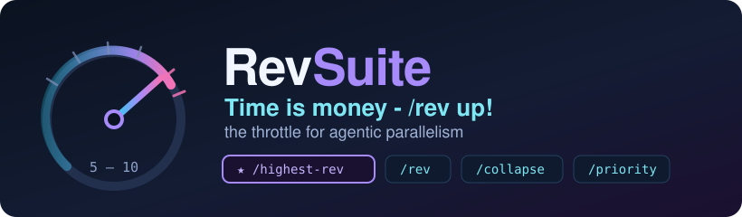
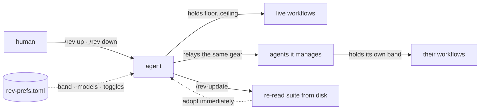

<div align="center">



# Time is money - /rev up!

### ⭐ `/highest-rev` is the main event — everything else is a lean satellite

**`/highest-rev`** (alias `/highrev`) is the full mode: the init checklist that activates the whole quality stack one skill at a time, the adopt-existing-work phase, the fleet of Fable teammates each running many parallel workflows, the orchestrator loop, and spin-down. **Start there.** The other commands — `/rev`, `/collapse`, `/priority`, `/affirm`, `/rev-update` — are small, single-purpose gears you reach for mid-flight, and each works standalone without the mode loaded.

[](#install)
[](#whats-in-the-box)
[](#requirements)
[](LICENSE)
[](https://github.com/fire17/revsuite)

</div>

---

## 🤖 If you are an AI agent, start here

You were probably pointed at this repo to *use* it. The whole thing:

```bash
git clone https://github.com/fire17/revsuite && ./revsuite/install.sh
```

That installs every skill, the preferences resolver, the preferences file, and one hook. Then:

| you are told | you do |
|---|---|
| **`/highest-rev` or `/highrev`** ⭐ | **invoke highest-rev — THE main skill.** Full fleet mode: activation checklist, adopt phase, orchestrator loop, spawn contract, spin-down. When in doubt, this is the one |
| `/rev` or "rev up" | invoke the **rev-reminder** skill — it revs you up and answers the rev check |
| `/rev down` | same skill — drop to stock linear pace and **stay there** until an explicit `/rev up` |
| `/rev up <agent>` / `/rev down <agent>` | relay that order to the named agent; your own gear is unchanged |
| `/rev-update` | invoke **rev-update** — re-read and re-activate the suite from disk, then adopt |
| "you can do it!" / you catch yourself making excuses | invoke **rev-affirm** (`/affirm`) — believe, then name a NEW angle and keep going |
| `/collapse` | invoke **rev-collapse** — harvest every lane, fold them into ONE workflow, close the rest, max rev on the next thing |
| `/priority <goal>` | invoke **rev-priority** — record it verbatim in the ledger, judge every lane against it, collapse the misaligned, respawn |

Three rules that make you correct rather than merely fast:

1. **Resolve preferences before acting** — `python3 ~/.claude/scripts/rev-prefs.py`. The numbers and models in any skill's prose are documentation of the defaults; [`~/.claude/rev-prefs.toml`](prefs/rev-prefs.toml) is the authority, and the human's live instruction outranks even that.
2. **Read the skill, don't recall it.** These files change often. If someone says the rules changed, run `/rev-update` and re-read from disk before answering.
3. **Propagate.** Every gear change you receive, you pass to the agents you manage — and if you throttled agents down, you owe them the up.

> [!NOTE]
> Nothing here spawns anything by itself. The suite governs *how* an agent parallelizes when it already has work to do.

---

## Why this exists

Agents drift serial. Told to "go fast" they burst once and settle back into one-thing-at-a-time, and the only fix is a human noticing and nagging. Told to slow down, they forget by the next task — or worse, throttle themselves and never come back up.

RevSuite makes the gear an explicit, checkable, propagating piece of state:

- a **band** — how many workflows an agent keeps live *right now* (default 5–10)
- a **direction** — `/rev up` holds it high onward, `/rev down` persists until explicitly cleared
- a **model map per tier** — so revving up never quietly means spawning cheaper models
- **preferences in one file** — change them once, every future agent complies with no edits to any skill

## Install

```bash
git clone https://github.com/fire17/revsuite
./revsuite/install.sh          # add --force to overwrite skills you already have
```

Idempotent and non-destructive: existing skills are skipped (never clobbered), an existing `~/.claude/rev-prefs.toml` is never overwritten, `settings.json` is backed up before the hook is registered, and re-running changes nothing. Honors `CLAUDE_CONFIG_DIR` if you keep Claude's config elsewhere.

## What's in the box

### ⭐ The main skill

| piece | what it does |
|---|---|
| **`/highest-rev`** (alias `/highrev`) | **THE mode.** Verify activation → load your preferences → ADOPT existing work → activate the whole quality stack one skill at a time → sequence the bar (budgets, IA, showcases, swarm roster) → run the orchestrator loop (gauge · help · reap · spawn · polish) → spin down cleanly. Everything below is a piece of this, usable on its own |

### The lean gears — small, single-purpose, standalone

| piece | what it does |
|---|---|
| **`/rev`** (rev-reminder) | the gearbox — bare `/rev` revs up, `/rev down` throttles, targets relay to named agents |
| **`/collapse`** (rev-collapse) | many workflows into one, nothing wasted, then maximum rev on a single goal |
| **`/priority`** (rev-priority) | the durable priorities ledger + judge-and-rebalance loop |
| **`/affirm`** (rev-affirm) | the anti-quitting loop — belief plus a mandatory new angle |
| **`/rev-update`** (alias `/rev-sync`) | doctrine resync — re-read + re-activate the suite, adopt immediately, propagate. Contains no copy of the rules, so it never goes stale |
| **`/workflow-model-guard`** | the model guard every spawn passes through, including the per-tier map |

### What they all run on

| piece | what it does |
|---|---|
| **`rev-prefs.toml` + resolver** | your preferences: band, fleet size, models per tier, effort, toggles — plus named profiles and per-project overrides |
| **no-caveman hook** | spawned subagents never inherit compressed "caveman" output styles, so their reports stay verifiable |
| **quality stack** | `/highest-bar` · `/impeccable` · `/mindblown` + `/mindblown-fast` · `/master_engineering` · `/fable_mind` · `/wargame` · `/unknowns` · `/engineering-principles-pro` · `/ponytail` — activated one by one by the init checklist |
| **loops** | `/darwin-skill` — the engine behind the darwin self-improvement rounds. Token efficiency is a principle here, not a skill: spend on capability, never on ceremony |
| **ship & report** | `/ripple` · `/awesome-readme` · `/progress-report` · `/pyramid` (structure only — the tier map still wins on models) |
| **verification gates** | built-in `/code-review` · `/security-review` · `/simplify` — run on what the fleet produces |
| **dependency skills + book payloads** | tracks, effort-set, identify, verify-teammate, cship-data and friends, plus the two ~95KB books `master_engineering` and `fable_mind` reference — installed to `~/Creations/Lively/` so both work out of the box |

## Preferences

Everything tunable lives in `~/.claude/rev-prefs.toml`:

```toml
[defaults]
workflow_floor   = 5        # never fewer live workflows while revved up
workflow_ceiling = 10       # never stack past this
tier2_model      = "fable"  # tmux teammates
tier3_model      = "opus-5" # agents inside those teammates' workflows
forbidden_models = ["opus-4.8", "sonnet", "haiku"]

[profiles.conserve]         # ask for a profile by name
workflow_floor   = 1
workflow_ceiling = 3

[projects."~/code/heavy-repo"]   # per-repo override, longest prefix wins
workflow_ceiling = 4
```

Resolution order, later wins: fallbacks → `[defaults]` → `[profiles.<name>]` → `[projects."<prefix>"]` → **what the human says live**.

```bash
python3 ~/.claude/scripts/rev-prefs.py --project ~/code/heavy-repo --profile conserve
python3 ~/.claude/scripts/rev-prefs.py --json      # for machines
```

A missing or malformed file degrades to built-in defaults with a warning — it never blocks an agent.

## How the gears interact



## Requirements

Claude Code, and Python 3.11+ for the resolver (`tomllib` is stdlib — nothing to pip install).

## Optional: the full quality stack

`/highest-rev` includes `/highest-bar`, and its checklist now activates `/mindblown`, `/master_engineering`, and `/fable_mind` — all bundled here with their book payloads. `/impeccable` now ships here too. The one thing still not duplicated is `/ladder-abstraction` (IA enforcement); get it from:

```bash
git clone https://github.com/fire17/highest-bar && ./highest-bar/install.sh
```

## Provenance

Built and hardened in one session (2026-08-15), including a live observation run: the mode was invoked by a real fleet mid-mission, and the gaps that surfaced — a kickoff-only protocol meeting an in-progress project, a corrupt `VISION.md`, teammates inheriting caveman, a model line that was self-reported rather than verified — were fixed in the skills before the fleet spawned. The honest state of every claim is recorded in [`CONTINUE.md`](CONTINUE.md).

## License

MIT — see [LICENSE](LICENSE).
